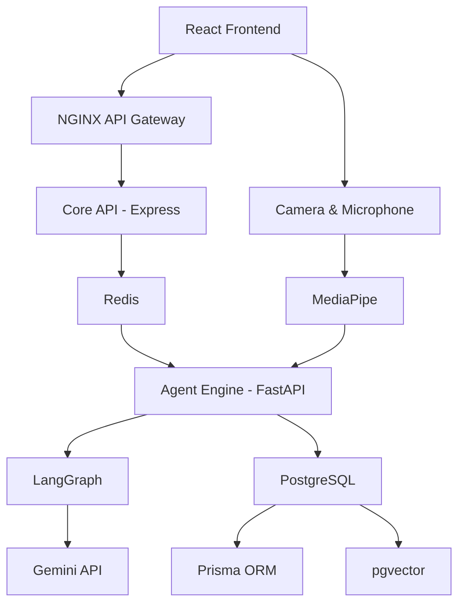

# 🚀 Lumify

> ### AI-Powered Interview Intelligence Platform
> **Powered by the InterviewDNA™ Engine**

Lumify is an AI-powered interview intelligence platform that helps candidates prepare for technical and behavioral interviews using Resume Intelligence, Competency Mapping, AI Mock Interviews, and Multimodal Evaluation.

Unlike traditional interview preparation platforms that analyze only textual responses, Lumify evaluates **what you say** and **how you say it** by combining resume understanding, speech analysis, and video-based behavioral analysis into one intelligent coaching experience.

At the core of Lumify is the **InterviewDNA™ Engine**, an adaptive intelligence profile that captures interview performance, competency gaps, and personalized learning insights to continuously improve future interview sessions.

---

# 📌 Problem Statement

Interview preparation today is mostly generic.

Candidates often:

- Practice random interview questions
- Don't know which skills are weak
- Receive no structured competency feedback
- Get evaluated only on answers, not communication
- Have no personalized improvement roadmap

---

# 💡 Solution

Lumify provides an AI-powered interview coaching workflow.

```text
Resume Upload
      │
      ▼
Resume Parser
      │
      ▼
Job Description Analysis
      │
      ▼
Competency Intelligence Engine
      │
      ▼
Gap Analysis Engine
      │
      ▼
Adaptive Interview Planner
      │
      ▼
AI Mock Interview
      │
      ▼
Text Analysis
Speech Analysis
Video Analysis
      │
      ▼
Multimodal Evaluation Engine
      │
      ▼
InterviewDNA™ Engine
      │
      ▼
Interview Intelligence Report
      │
      ▼
Personalized Learning Roadmap
```

Lumify behaves like a real interview coach that understands candidate strengths, communication patterns, and improvement opportunities instead of acting as a simple chatbot.

---

# ✨ Key Features

## Resume Intelligence

- PDF Resume Upload
- Resume Parsing
- Skill Extraction
- Resume Evidence Mapping

## Job Intelligence

- Job Description Analysis
- Company Requirement Extraction
- Competency Mapping
- Skill Gap Analysis

## AI Interview

- Adaptive Interview Planning
- AI Question Generation
- Technical Interviews
- Behavioral Interviews

## Multimodal Evaluation

- Text Analysis
- Speech Analysis
- Video Behavioral Analysis
- Confidence Detection
- Eye Contact Analysis
- Communication Scoring
- Posture & Engagement Analysis

## AI Coaching

- InterviewDNA™ Engine
- Interview Intelligence Report
- Personalized Learning Roadmap
- Suggested Practice Schedule

---

# 🎯 MVP Scope

## ✅ Layer 1 — Fully Working Demo

The following features will be fully implemented and demonstrated:

```text
User Authentication
        │
        ▼
Resume Upload
        │
        ▼
Job Description Input
        │
        ▼
Resume Parser
        │
        ▼
Competency Intelligence Engine
        │
        ▼
Gap Analysis
        │
        ▼
Adaptive Interview Planner
        │
        ▼
AI Interview
        │
        ▼
Text + Speech + Video Analysis
        │
        ▼
Multimodal Evaluation Engine
        │
        ▼
Interview Intelligence Report
```

---

## 🟡 Layer 2 — Simplified MVP

These features exist with limited implementation.

- InterviewDNA™ Memory
- Personalized Learning Roadmap
- Suggested Weekly Practice Schedule

---

## 🔵 Layer 3 — Production Roadmap

Future production features include:

- Continuous InterviewDNA Evolution
- Redis-backed AI Queues
- AI Response Caching
- Calendar Integration
- Notifications
- Recruiter Dashboard
- Mentor Dashboard
- Team Analytics
- Enterprise Version

---

# 🏗️ High-Level Architecture



---

# 🤖 AI Workflow

```text
Planner Agent
        │
        ▼
Resume Parser Agent
        │
JD Parser Agent
        │
User Context
        │
        ▼
Competency Intelligence Engine
        │
        ▼
Gap Analysis Engine
        │
        ▼
Adaptive Interview Planner
        │
        ▼
Question Generator Agent
        │
        ▼
Live Interview Session
        │
 ┌───────────────┬────────────────┬────────────────┐
 ▼               ▼                ▼
Text Analyzer  Speech Analyzer  Video Analyzer
        │
        └───────────────┬────────────────┘
                        ▼
        Multimodal Evaluation Engine
                        │
                        ▼
            InterviewDNA™ Engine
                        │
        ┌───────────────┴────────────────┐
        ▼                                ▼
Learning Roadmap         Interview Intelligence Report
```

---

# 🧠 Multi-Agent Architecture

Lumify uses multiple specialized AI agents.

- Planner Agent
- Resume Parser Agent
- Job Description Parser Agent
- Competency Intelligence Engine
- Gap Analysis Engine
- Adaptive Interview Planner
- Question Generator Agent
- Speech Analysis Agent
- Video Analysis Agent
- Text Analysis Agent
- Multimodal Evaluation Engine
- InterviewDNA™ Engine
- Learning Planner Agent
- Interview Intelligence Report Generator

Each agent performs a single responsibility, making the system modular, scalable, and production-ready.

---

# 🗄️ Database Design

Core Entities

- User
- Resume
- TargetCompany
- TargetRole
- Skill
- Competency
- CompetencyScore
- Assessment
- Question
- QuestionAttempt
- InterviewSession
- InterviewFeedback
- InterviewDNAMemory
- LearningRoadmap
- RoadmapTask
- CalendarEvent
- Notification

Database: **PostgreSQL + Prisma + pgvector**

---

# 🔒 Security

- JWT Authentication
- bcrypt Password Hashing
- Helmet Security
- Zod Validation
- CORS Protection
- Redis Rate Limiting
- Secure Environment Variables
- Input Sanitization

---

# 🔐 Privacy

Lumify follows a **privacy-first** design.

Users explicitly opt in before InterviewDNA™ stores interview summaries for personalized coaching.

Without consent, interview data is processed temporarily and discarded after report generation.

---

# 🚀 Tech Stack

| Layer | Technology |
|---------|------------|
| Frontend | React + Vite |
| Styling | CSS / Tailwind CSS |
| Core API | Node.js + Express |
| AI Engine | FastAPI + LangGraph |
| LLM | Gemini API |
| Database | PostgreSQL |
| ORM | Prisma |
| Vector DB | pgvector |
| Cache | Redis |
| Gateway | NGINX |
| Deployment | Docker, Render, Vercel |

---

# 📂 Folder Structure

```text
lumify/

├── frontend/
├── core-api/
├── agent-engine/
├── shared/
├── docs/
├── infra/
├── docker-compose.yml
├── README.md
└── .gitignore
```

---

# ⚙️ Installation

## Frontend

```bash
cd frontend
npm install
npm run dev
```

## Core API

```bash
cd core-api
npm install
npx prisma generate
npm run dev
```

## Agent Engine

```bash
cd agent-engine
pip install -r requirements.txt
uvicorn main:app --reload
```

## Docker

```bash
docker compose up --build
```

---

# 📚 Documentation

- Architecture
- API Documentation
- Database Design
- Agent Workflow
- Wireframes
- Deployment
- Security

---

# 🌍 Production Roadmap

- Resume RAG using pgvector
- Advanced LangGraph Workflows
- Real-time Speech Analysis
- MediaPipe Behavioral Analysis
- Adaptive InterviewDNA Evolution
- Recruiter Dashboard
- Mentor Dashboard
- Enterprise Analytics
- CI/CD Pipeline
- Cloud Monitoring

---

# ⭐ Why Lumify?

Traditional interview platforms evaluate only **answers**.

Lumify evaluates:

- Resume Quality
- Job Fit
- Competency Gaps
- Technical Knowledge
- Communication Skills
- Speech Delivery
- Video-Based Behavioral Signals
- Personalized Improvement Roadmaps

By combining these signals, Lumify provides a complete interview intelligence experience rather than a simple question-answer chatbot.

---

## 👨‍💻 Built for

Hackathons • AI Engineering • Software Engineering • Agentic AI • Career Intelligence • Interview Preparation