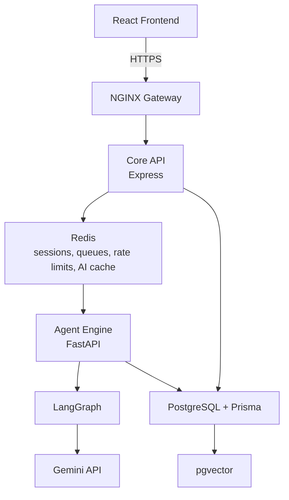
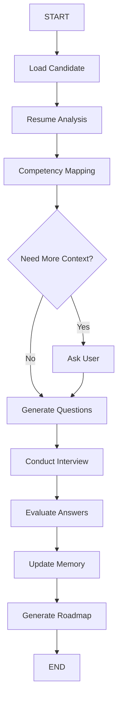

# InterviewDNA

InterviewDNA is an adaptive AI interview coach. It analyzes a candidate's
resume and target job description, builds an InterviewDNA memory profile,
generates targeted interviews, evaluates multimodal answers, and turns every
session into a smarter next practice plan.

## Problem Statement

Interview preparation is usually generic. Candidates practice random questions
without knowing which competencies are weak, which resume claims need stronger
evidence, or how their previous interview performance should change the next
session.

## Solution

InterviewDNA creates a feedback loop:

```text
Upload Resume + Target JD
-> Resume Parsing and Skill Extraction
-> Competency Intelligence Engine
-> Adaptive Interview Planner
-> AI Mock Interview
-> Multimodal Evaluation Engine
-> InterviewDNA Memory Update
-> Personalized Learning Roadmap
-> Calendar and Next Practice
```

The system behaves like a coach that remembers progress instead of a chatbot
that starts from zero every time.

## Features

- Resume upload and skill extraction
- Target company and job description matching
- Competency mapping and gap analysis
- Adaptive interview planning
- Question generation for target roles
- Text, audio, and video answer references
- NLP, speech, and video analysis pipeline design
- Multimodal evaluation and scoring
- InterviewDNA memory profile
- Interview Intelligence Report
- Personalized learning roadmap and roadmap tasks
- Calendar events and notifications

## MVP Scope

### Layer 1: Demoable Core Workflow

These are the features the MVP is designed to demo confidently:

```text
User Login
-> Upload Resume PDF
-> Paste Job Description
-> Resume Parser
-> Competency Intelligence Engine
-> Gap Analysis
-> Adaptive Interview Planner
-> AI Interview
-> Text + Audio + Video Analysis
-> Multimodal Evaluation Engine
-> Interview Intelligence Report
```

### Layer 2: Simplified MVP

- InterviewDNA MVP memory stores the current interview summary for demo reuse.
- Learning Roadmap generates Week 1, Week 2, and Week 3 practice tasks.
- Calendar produces a suggested practice schedule: Monday, Wednesday, Saturday.

### Layer 3: Planned Production Features

- Redis-backed queues and AI response caching
- Full adaptive memory across repeated interviews
- Continuous InterviewDNA evolution
- Calendar integration
- Notifications
- Advanced analytics
- Team dashboard
- Recruiter portal

## Architecture



## Technology Stack

| Layer | Technology |
| --- | --- |
| Frontend | React, Vite, CSS, lucide-react |
| Core API | Node.js, Express, Zod, Helmet, CORS |
| Agent Engine | Python, FastAPI, LangGraph, Gemini API |
| Database | PostgreSQL, Prisma, pgvector |
| Cache and queues | Redis |
| Gateway | NGINX |
| DevOps | Docker Compose, GitHub Actions |
| Design | Figma wireframes |

## AI Workflow



## Multi-Agent Design

```text
Planner Agent
  -> Resume Parser
  -> JD Parser
  -> User Context
  -> Competency Intelligence Engine
  -> Gap Analysis Engine
  -> Adaptive Interview Planner
  -> Question Generator Agent
  -> Live Interview Session
  -> Text Analyzer
  -> Speech Analyzer
  -> Video Analyzer
  -> Multimodal Evaluation Engine
  -> InterviewDNA MVP Memory
  -> Learning Planner
  -> Interview Intelligence Report
```

This design demonstrates planning, coordination, memory, learning, and
adaptation. Each interview updates the InterviewDNA memory profile, making the
next interview more targeted.

## Database Design

Core entities:

- User
- Resume
- TargetCompany
- TargetRole
- Skill
- Competency
- CompetencyScore
- Assessment
- Question
- QuestionAttempt
- Hint
- InterviewSession
- InterviewFeedback
- InterviewDnaMemory
- LearningRoadmap
- RoadmapTask
- CalendarEvent
- Notification

The Prisma schema is located at `core-api/prisma/schema.prisma`.

## API Documentation

Milestone 1 includes health, resume, and assessment API skeletons. Full API
details are documented in `docs/api.md`.

## Security

Planned and partially scaffolded controls:

- JWT authentication
- bcrypt password hashing
- Zod request validation
- Helmet HTTP hardening
- CORS allowlist through `FRONTEND_ORIGIN`
- Redis-backed rate limiting
- Input validation before persistence
- Environment-based secrets

## Privacy

InterviewDNA is privacy-first. Users explicitly opt in to save InterviewDNA
memory for personalized coaching. If they do not opt in, interview data is
processed temporarily and discarded after report generation.

## Deployment

```text
Frontend
  -> Vercel
  -> NGINX Gateway
  -> Render Core API
  -> Redis
  -> Render Agent Engine
  -> Gemini API
  -> Managed PostgreSQL
  -> pgvector
```

## Folder Structure

```text
interviewdna/
|-- frontend/
|-- core-api/
|   |-- prisma/
|   `-- src/
|       |-- config/
|       |-- controllers/
|       |-- middleware/
|       |-- repositories/
|       |-- routes/
|       |-- services/
|       |-- validators/
|       |-- sockets/
|       |-- utils/
|       `-- server.js
|-- agent-engine/
|   |-- agents/
|   |-- graphs/
|   |-- nodes/
|   |-- state/
|   |-- prompts/
|   |-- tools/
|   |-- rag/
|   |-- embeddings/
|   |-- memory/
|   |-- utils/
|   `-- main.py
|-- shared/
|   |-- schemas/
|   `-- constants/
|-- infra/
|   |-- docker/
|   |-- nginx/
|   `-- github-actions/
|-- docs/
|-- README.md
|-- docker-compose.yml
`-- .gitignore
```

## Installation

### Frontend

```bash
cd frontend
npm install
npm run dev
```

### Core API

```bash
cd core-api
npm install
npx prisma generate
npm run dev
```

### Agent Engine

```bash
cd agent-engine
pip install -r requirements.txt
uvicorn main:app --reload
```

### Docker Compose

```bash
docker compose up --build
```

## Documentation

- [Architecture](docs/architecture.md)
- [API Documentation](docs/api.md)
- [Database Design](docs/database.md)
- [Agent Workflow](docs/agent-workflow.md)
- [Wireframes](docs/wireframes.md)
- [Deployment](docs/deployment.md)
- [Security](docs/security.md)

## Future Scope

- Full JWT authentication and RBAC
- Resume PDF parsing pipeline
- LangGraph implementation for all workflow nodes
- pgvector-backed retrieval over resume evidence and interview memory
- Redis queues for long-running AI jobs
- Audio and video analysis integrations
- Calendar provider integration
- Mentor dashboard
- Production CI/CD and observability
