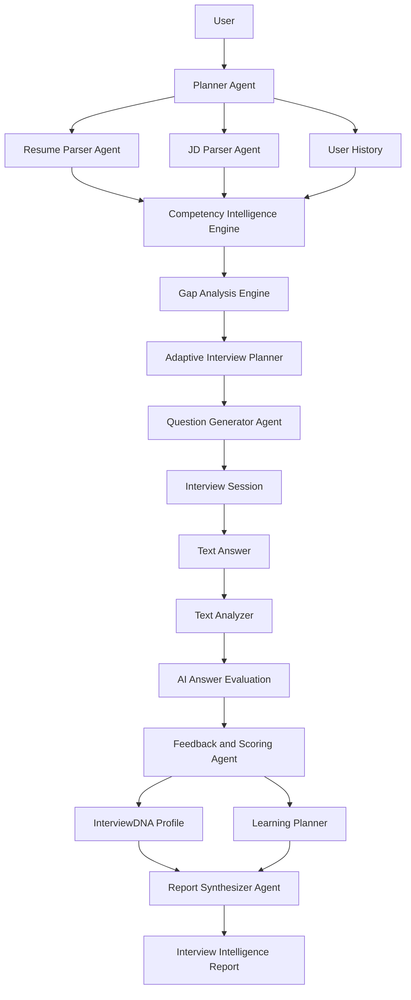
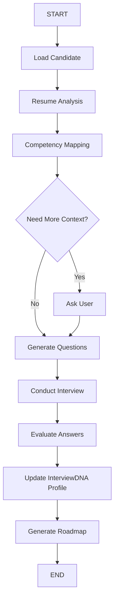

# Agent Workflow

Lumify uses a Milestone 2 agent workflow for resume analysis, job description
analysis, competency gap detection, question generation, answer evaluation, and
InterviewDNA profile updates.

## MVP Agent Flow



## InterviewDNA Module

InterviewDNA is a module inside Lumify, not the product name. In Milestone 2,
Lumify stores the current interview summary, strengths, gaps, feedback, and
learning recommendations as part of the user's InterviewDNA profile.

## LangGraph Flow



## Agent Roles

| Agent | Responsibility |
| --- | --- |
| Planner Agent | Coordinates the workflow and selects next actions |
| Resume Parser Agent | Extracts skills, projects, and evidence from resumes |
| JD Parser Agent | Converts target job descriptions into expectations |
| Competency Intelligence Engine | Maps resume evidence against target role needs |
| Gap Analysis Engine | Finds missing competencies and weak evidence |
| Adaptive Interview Planner | Chooses question strategy based on memory and gaps |
| Question Generator Agent | Generates role-specific questions |
| Text Analyzer | Evaluates text answers |
| Feedback and Scoring Agent | Produces scores and coaching feedback |
| Learning Planner | Generates roadmap tasks |
| Report Synthesizer Agent | Creates the Interview Intelligence Report |
| Progress Tracker | Updates readiness trends over time |

## Profile Loop

```text
Interview 1
-> Interview Intelligence Report
-> InterviewDNA Profile
-> Interview 2 becomes more targeted
-> Profile updates again
-> Interview 3 can use prior progress
```

The InterviewDNA profile is Lumify's personalization layer. Future milestones
can add richer adaptive behavior, speech analysis, video analysis, calendar
integration, notifications, and long-term retrieval.
