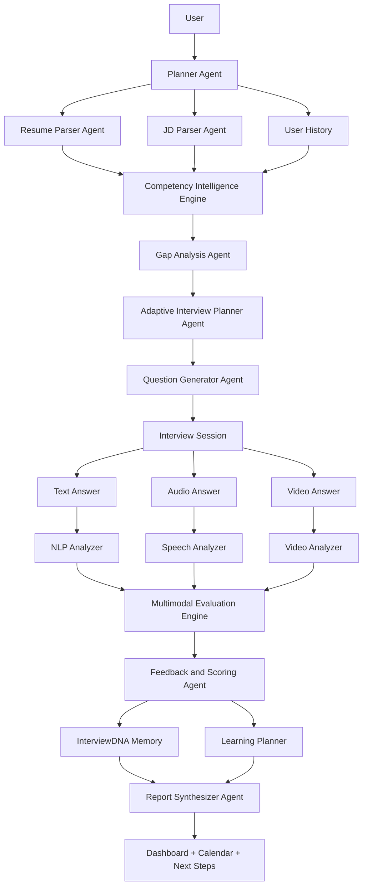
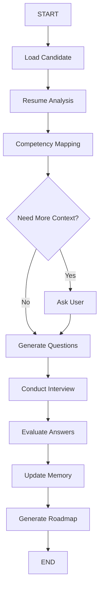

# Agent Workflow

InterviewDNA uses an adaptive multi-agent design. The agents are not just
calling an LLM; they coordinate, evaluate, remember, and adapt future sessions.

## Production-Level Agent Flow



## LangGraph Flow



## Agent Roles

| Agent | Responsibility |
| --- | --- |
| Planner Agent | Coordinates the workflow and selects next actions |
| Resume Parser Agent | Extracts skills, projects, and evidence from resumes |
| JD Parser Agent | Converts target job descriptions into expectations |
| Competency Intelligence Engine | Maps resume evidence against target role needs |
| Gap Analysis Agent | Finds missing competencies and weak evidence |
| Adaptive Interview Planner Agent | Chooses question strategy based on memory and gaps |
| Question Generator Agent | Generates role-specific questions |
| NLP Analyzer | Evaluates text answers |
| Speech Analyzer | Evaluates audio delivery signals |
| Video Analyzer | Evaluates video presence signals |
| Multimodal Evaluation Engine | Combines text, speech, and video signals |
| Feedback and Scoring Agent | Produces scores and coaching feedback |
| Learning Planner | Generates roadmap tasks |
| Report Synthesizer Agent | Creates the Interview Intelligence Report |
| Calendar Scheduler | Schedules the next practice session |
| Progress Tracker | Updates readiness trends over time |

## Memory Loop

```text
Interview 1
-> Interview Intelligence Report
-> InterviewDNA Memory
-> Interview 2 becomes more targeted
-> Memory updates again
-> Interview 3 adapts further
```

The memory loop is the product's key differentiator: every session makes the
candidate profile smarter.
