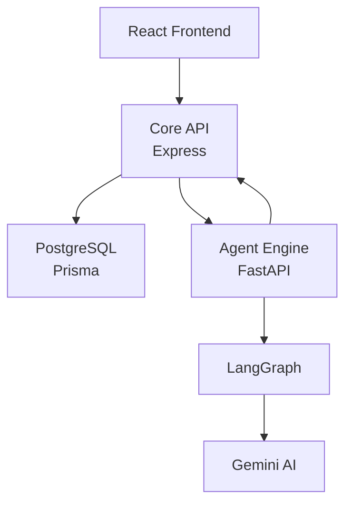
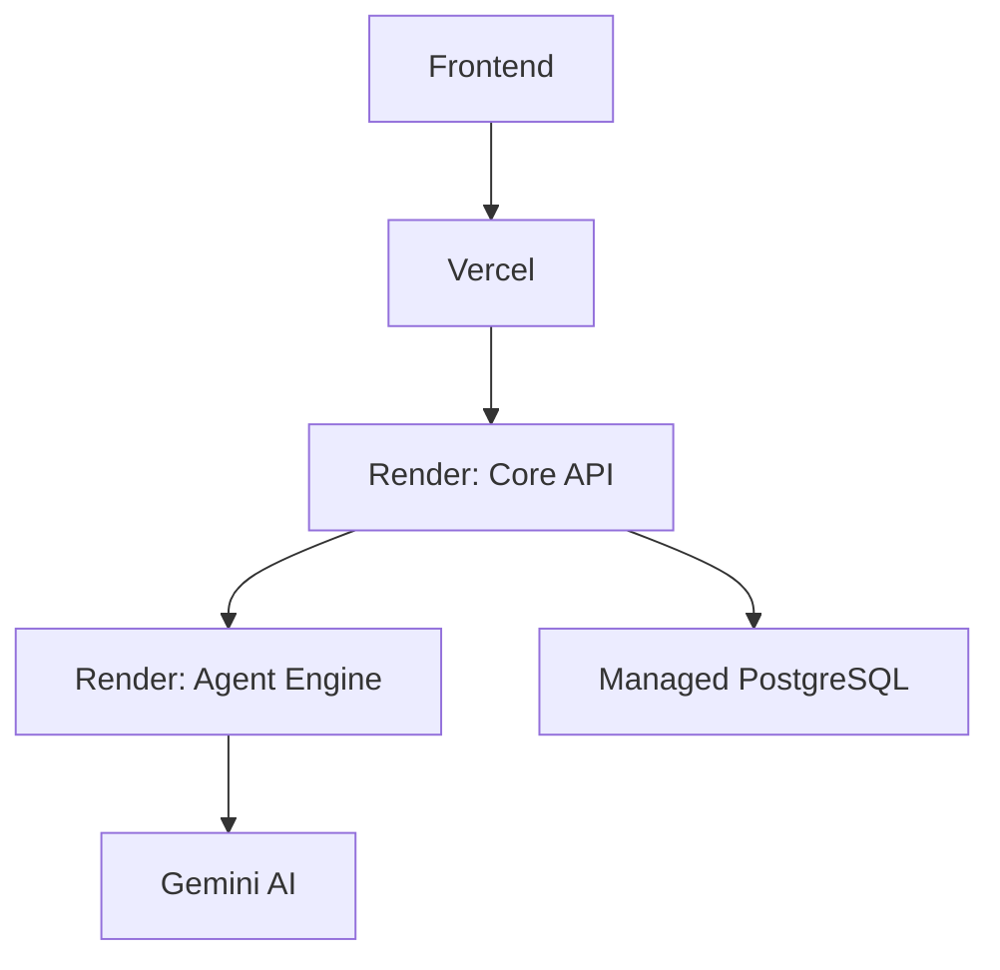

# Architecture

Lumify is a Milestone 2 monorepo with a React frontend, an Express Core API, a
FastAPI Agent Engine, LangGraph workflow orchestration, Gemini AI integration,
and PostgreSQL persistence through Prisma.



## Service Responsibilities

| Service | Responsibility |
| --- | --- |
| Frontend | Candidate journey, resume upload, company selection, interview flow, roadmap, progress dashboard |
| Core API | Auth, users, resumes, protected interview routes, answer evaluation, persistence |
| Agent Engine | Multi-agent orchestration, LangGraph nodes, memory updates, question planning, evaluation, roadmap generation |
| PostgreSQL + Prisma | System of record for users, resumes, interview sessions, questions, and learning roadmap rows |

## Deployment Story



## InterviewDNA Module

Lumify includes InterviewDNA as a personalized interview profile module. Each
interview can update the user's InterviewDNA profile with summaries, feedback,
competency gaps, strengths, and learning recommendations.

```text
Upload Resume + Target JD
-> Competency Intelligence Engine
-> Adaptive Interview Planner
-> AI Answer Evaluation
-> InterviewDNA Profile Update
-> Personalized Learning Roadmap
-> Interview Intelligence Report
```
