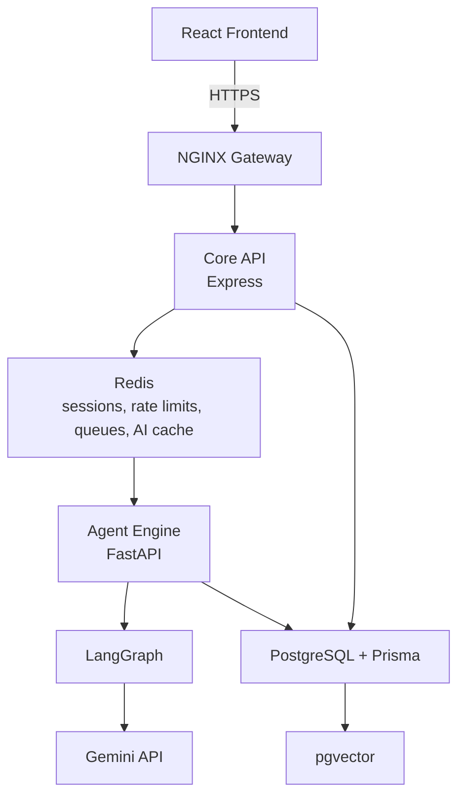
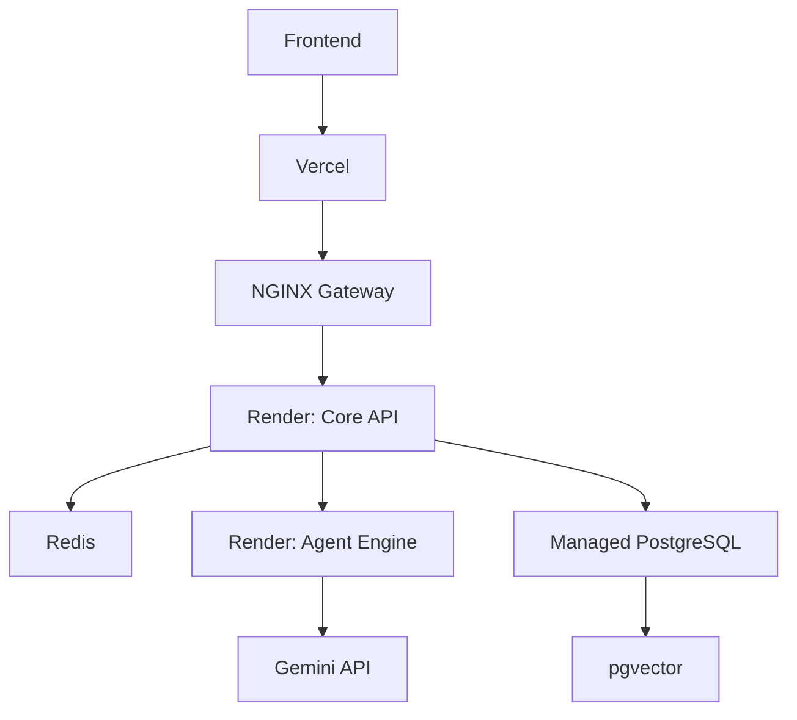

# Architecture

InterviewDNA is a production-style monorepo with a React frontend, an Express
Core API, a FastAPI Agent Engine, Redis for fast coordination, and PostgreSQL
with pgvector for relational and retrieval storage.



## Service Responsibilities

| Service | Responsibility |
| --- | --- |
| Frontend | Candidate journey, resume upload, company selection, interview flow, roadmap, progress dashboard |
| Core API | Auth, users, resumes, roles, assessments, attempts, roadmaps, calendars, notifications, persistence |
| Redis | Session cache, rate limiting, async job queue, AI-response cache, interview state handoff |
| Agent Engine | Multi-agent orchestration, LangGraph nodes, memory updates, question planning, evaluation, roadmap generation |
| NGINX Gateway | TLS termination, routing, reverse proxy, service isolation |
| PostgreSQL + pgvector | System of record plus vector search over resume evidence, feedback, and learning resources |

## Deployment Story



## Adaptive Intelligence Loop

InterviewDNA does not stop after a report. Each session updates
`InterviewDnaMemory`, which helps the next interview become more targeted and
appropriately difficult.

```text
Upload Resume + Target JD
-> Competency Intelligence Engine
-> Adaptive Interview Planner
-> Multimodal Evaluation Engine
-> InterviewDNA Memory Update
-> Personalized Learning Roadmap
-> Calendar + Next Practice
```
