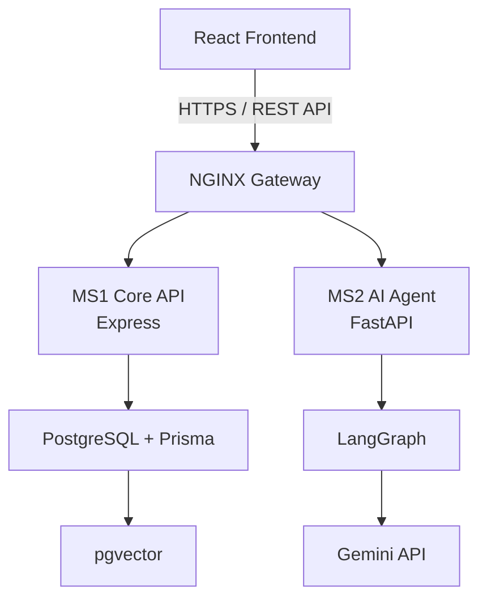

# Architecture

InterviewDNA is designed as a small production monorepo with a separated
frontend, core business API, and AI agent service.

## Service Responsibilities

| Service | Responsibility |
| --- | --- |
| Frontend | Candidate experience, resume upload, assessment UI, dashboard, analytics |
| MS1 Core API | Authentication, users, resumes, assessments, attempts, schedules, persistence |
| MS2 AI Agent | Planner graph, resume analysis, competency extraction, roadmap generation, hints, interview evaluation |
| NGINX Gateway | TLS termination, routing, service isolation, rate-limit boundary |
| PostgreSQL + pgvector | Relational system of record plus vector retrieval for RAG |

## Multi-Agent Flow

Planner Agent -> Resume Analyzer -> Competency Agent -> Assessment Agent ->
Roadmap Generator -> Hint Generator -> Interview Evaluator.

The Planner chooses which specialist agent runs next. The Core API stores
canonical data, while the Agent service performs reasoning and returns
structured outputs that MS1 can validate and persist.
