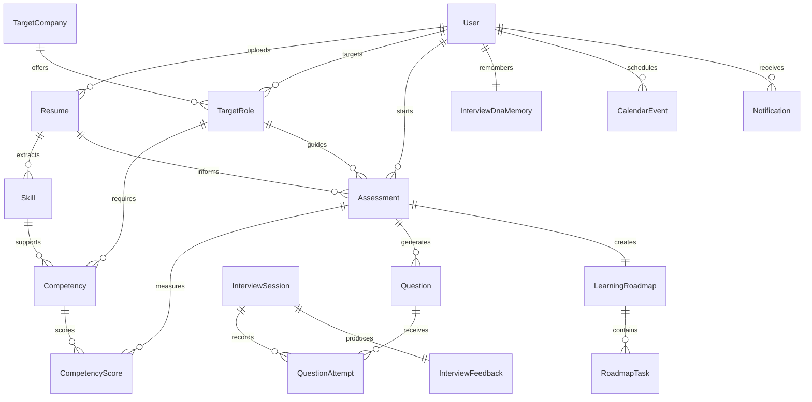

# Database Design

InterviewDNA stores the candidate journey as an adaptive coaching loop. The
schema supports resume parsing, target company/role context, competency
intelligence, multimodal interview attempts, memory, feedback, roadmaps,
calendar events, and notifications.

## Core Entities

| Entity | Purpose |
| --- | --- |
| User | Candidate account and experience level |
| Resume | Uploaded resume and parsed resume summary |
| TargetCompany | Company the candidate is preparing for |
| TargetRole | Job description, role title, and seniority context |
| Skill | Extracted resume skill with confidence and evidence |
| Competency | Role competency expected for the target job |
| CompetencyScore | Gap score, evidence, and recommendation |
| Assessment | Adaptive evaluation plan for a resume and target role |
| Question | Generated interview or assessment question |
| QuestionAttempt | Text, audio, or video answer plus score and feedback |
| Hint | Contextual help for a question |
| InterviewSession | Live or scheduled mock interview |
| InterviewFeedback | Interview Intelligence Report data |
| InterviewDnaMemory | Persistent learning memory across sessions |
| LearningRoadmap | Personalized preparation plan |
| RoadmapTask | Specific task tied to a competency gap |
| CalendarEvent | Scheduled practice or interview event |
| Notification | Candidate reminder or product update |

The implementation lives in `core-api/prisma/schema.prisma`.
